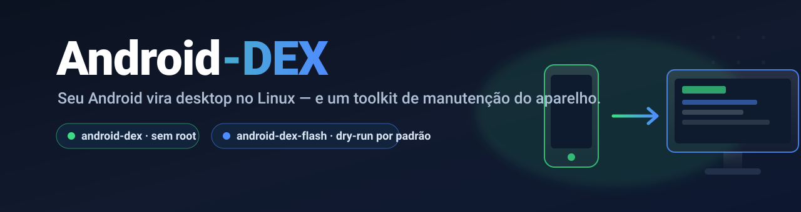
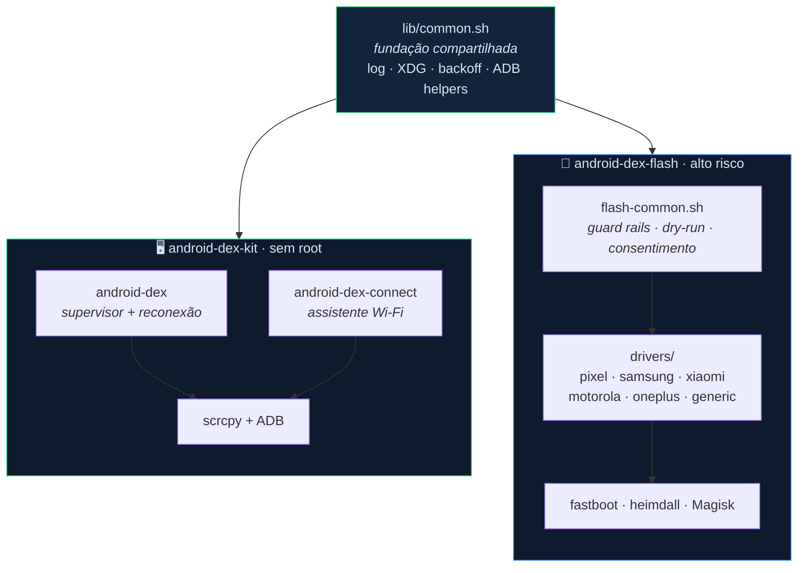

<div align="center">



<br>

**Transforme um Android conectado em um desktop no Linux — e cuide do aparelho de ponta a ponta.**
Dois toolkits irmãos, em shell puro, sobre as ferramentas oficiais (`scrcpy`, `adb`, `fastboot`, `heimdall`, `Magisk`).

<br>


</div>

---

## ✨ O que é isto?

Um workspace com **dois projetos que compartilham a mesma fundação** (`lib/common.sh`: logging com rotação, diretórios XDG, backoff exponencial e helpers de ADB):

| Projeto | O que faz | Risco | Root? |
| :-- | :-- | :--: | :--: |
| 🖥️ **[android-dex-kit](android-dex-kit/)** | Experiência **desktop/DeX** via `scrcpy + ADB`, com modo automático, perfis OEM, supervisor resiliente, systemd e udev. | 🟢 baixo | ❌ não |
| 🔧 **[android-dex-flash](android-dex-flash/)** | Diagnóstico e manutenção guiada, com bundles não executáveis e descritores assinados; gravações sem validação permanecem bloqueadas. | 🔴 alto | ⚠️ opcional |

> [!NOTE]
> São **separados de propósito**: espelhar a tela é inofensivo; mexer em bootloader e partições pode **brickar** o aparelho. A separação evita apertar o botão errado.

---

## 🧭 Índice

- [Arquitetura](#-arquitetura)
- [android-dex — desktop sem root](#️-android-dex--desktop-sem-root)
- [android-dex-flash — manutenção do aparelho](#-android-dex-flash--manutenção-do-aparelho)
- [Compatibilidade por marca](#-compatibilidade-por-marca)
- [Segurança](#-segurança-android-dex-flash)
- [Roadmap](#️-roadmap)
- [Créditos](#-créditos)

---

## 🏗️ Arquitetura



---

## 🖥️ android-dex — desktop sem root

Modo automático tenta **DeX** somente quando SDK/capacidades o sustentam e cai
para **mirror** quando houver dúvida ou falha rápida. Perfis OEM ajustam launcher
e decorações; USB/Wi-Fi reconectam com backoff exponencial.

<details open>
<summary><b>Instalar e usar (30 segundos)</b></summary>

```bash
cd android-dex-kit
./install.sh                 # instala scrcpy/adb, udev, launcher, systemd

# no aparelho: Opções do desenvolvedor → Depuração USB
android-dex                  # auto-detecta e sobe a sessão

android-dex-connect          # migra p/ Wi-Fi (emparelha e salva o IP)
android-dex --wifi           # conecta pelo IP salvo
android-dex --list           # lista aparelhos; --device escolhe um deles
android-dex --status         # estado, dispositivos e sessão ativa
android-dex-doctor           # diagnóstico somente leitura + capacidades
```
</details>

👉 Detalhes completos em **[android-dex-kit/README.md](android-dex-kit/README.md)**.

---

## 🔧 android-dex-flash — manutenção do aparelho

Um **orquestrador** das ferramentas oficiais de cada fabricante — **nunca** um "motor de flash" próprio. Existe para reduzir **erro humano**, não para eliminar o **risco físico**.

> [!WARNING]
> Só use no **seu próprio aparelho**. Desbloqueio de bootloader, root e flash podem **brickar** o aparelho e frequentemente são **irreversíveis** (Knox e-fuse, Play Integrity, garantia).

**O que torna "seguro e amigável" real:**

- 🧪 **`--dry-run` é o padrão** — nada é gravado até você pedir `--commit`.
- ⌨️ **Consentimento digitado** — antes de gravar, você digita `SIM` (não aceita `y`).
- 🛡️ **Guard rails** — confere modelo, bateria mínima, hash sha256 dos insumos e faz backup do boot.
- ⚠️ **Avisos por marca** — ex.: o Knox e-fuse da Samsung é permanente.

<details>
<summary><b>Comece sempre pelo diagnóstico (risco ZERO)</b></summary>

```bash
cd android-dex-flash
./install.sh

android-dex-flash info       # marca/modelo/SO/bootloader + o que é possível e o que se perde
android-dex-flash caps       # capacidades e riscos do seu modelo
android-dex-flash check-rollback DIR # assinatura + anti-downgrade
android-dex-flash backup-boot        # backup com manifesto e SHA-256
android-dex-flash extract-payload payload.bin DIR

# ações que gravam — dry-run por padrão:
android-dex-flash unlock             # simula (mostra a sequência exata)
android-dex-flash unlock --commit    # só em drivers dedicados certificados
android-dex-flash flash-firmware DIR # roteiro guiado; não executa scripts
```
</details>

👉 Detalhes completos e limites honestos em **[android-dex-flash/README.md](android-dex-flash/README.md)**.

---

## 📱 Compatibilidade por marca

**Modo desktop (`android-dex`):**

| Marca / SO | Experiência | Ajuste |
| :-- | :-- | :-- |
| Samsung One UI 8 / Android 15+ | 🟢 DeX nativo no display virtual | funciona direto |
| Pixel / AOSP 15+ | 🟡 desktop mode (às vezes exige tela física) | `START_APP` |
| Xiaomi / Oppo / Motorola | 🟡 abre vazio, precisa de launcher | `START_APP` + `VD_SYSTEM_DECORATIONS=0` |
| Qualquer aparelho | 🟢 `MODE="mirror"` | sempre funciona |

**Manutenção (`android-dex-flash`):**

| Marca | Desbloqueio | Observação central |
| :-- | :-- | :-- |
| **Pixel / AOSP** | `fastboot flashing unlock` | caminho mais limpo (referência) |
| **Samsung** | modo Download + confirmação física | 🔥 **queima o Knox — permanente**; usa `heimdall` |
| **Xiaomi/Redmi/POCO** | Mi Unlock oficial + espera | a ferramenta **guia**, não burla |
| **Motorola/Lenovo** | código do site oficial | `get_unlock_data` → e-mail → `oem unlock` |
| **OnePlus/Oppo/Realme/Sony** | `fastboot flashing unlock` | Oppo/Realme podem exigir app oficial |

---

## 🔒 Segurança (android-dex-flash)

```text
ação destrutiva
   └─ fingerprint do device ......... quem é o aparelho?
   └─ avisos por OEM ................ o que você perde?
   └─ --dry-run (padrão) ............ mostra os comandos, não grava
        └─ driver permite --commit? . root/firmware/restore: não (fail-closed)
        └─ --commit (somente ação certificada)
             └─ bateria ≥ 40% ....... trava se estiver baixa
             └─ modelo confere ...... recusa firmware de outro modelo
             └─ hash sha256 ......... integridade dos insumos
             └─ digitar "SIM" ....... consentimento explícito
                  └─ executa + loga tudo (auditoria)
```

A ferramenta é **honesta sobre o que não faz**: não burla espera de unlock, não desbloqueia aparelhos travados pelo fabricante e não restaura Knox/Play Integrity perdidos.

---

## 🗺️ Roadmap

Plano completo em **[ROADMAP.md](ROADMAP.md)** — 10 melhorias do kit (ordenadas por impacto) e as fases 0→4 do flash. Destaques:

- **A1** — regra udev por *vendor id* (compatibilidade plug-and-play entre marcas)
- **A3 / A4** — perfis por dispositivo + detecção automática de `dex` vs `mirror`
- **Flash Fase 0** ✅ `device-info` (pronto) → Fases 1–3 (Pixel/Samsung/Xiaomi/Motorola/OnePlus)

---

## 🙏 Créditos

Construído sobre [scrcpy](https://github.com/Genymobile/scrcpy) (Genymobile) e as ferramentas oficiais [platform-tools](https://developer.android.com/tools/releases/platform-tools) (Google), [Heimdall](https://gitlab.com/BenjaminDobell/Heimdall) e [Magisk](https://github.com/topjohnwu/Magisk). Inspirado no [Android-Dex](https://github.com/Shrey113/Android-Dex) (Shrey113). Firmware sempre de fontes **oficiais** do fabricante.

<div align="center">

**[⬆ voltar ao topo](#)** · Feito com shell, cuidado e muitos avisos de segurança.

</div>
